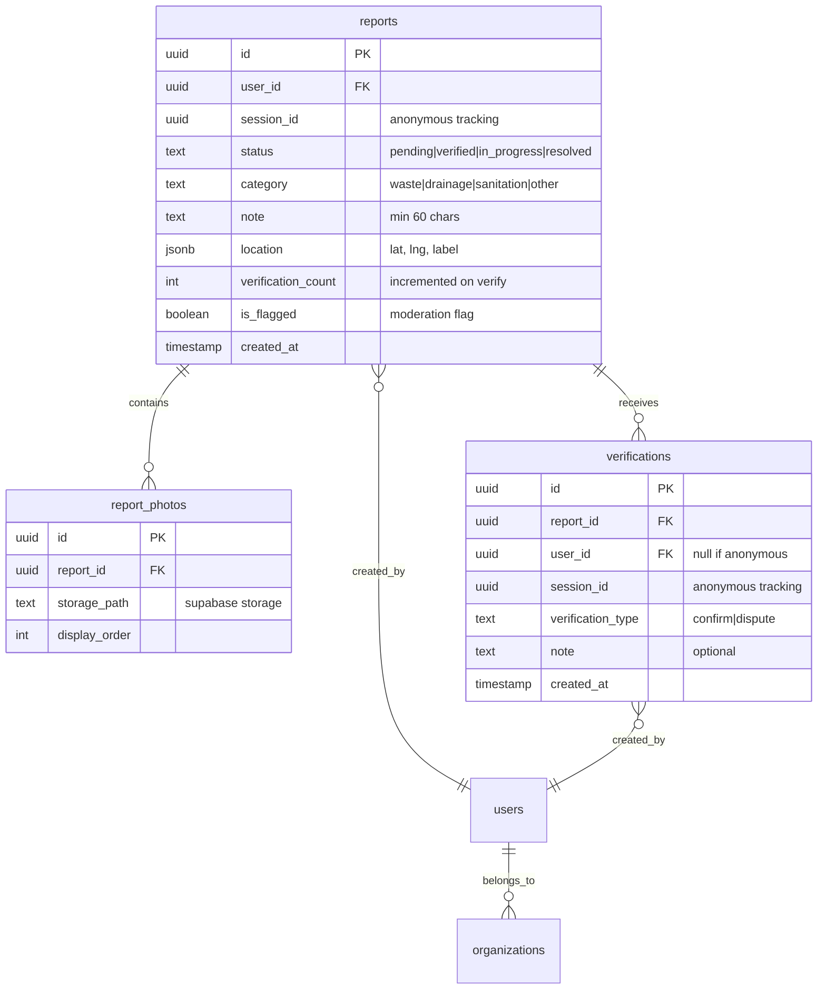
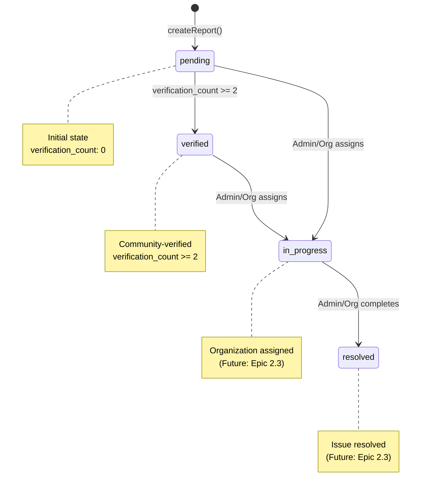

# Domain Rules & Business Logic

Complete reference for EcoPulse MVP business rules, workflows, and domain constraints.

## Core Domain Model



## Report Lifecycle

### 1. Report Creation (`createReport.ts`)

**Business Rules:**

- ✅ Requires ≥1 photo (uploaded first via `uploadPhoto.ts`)
- ✅ Requires location (lat, lng, label from geocoding)
- ✅ Requires category selection
- ✅ Requires note ≥ 60 characters
- ✅ Sets initial `status: 'pending'`
- ✅ Sets initial `verification_count: 0`
- ✅ Sets `is_flagged: false`

**Authentication States:**

```typescript
// Authenticated user
const { user_id, session_id } = await getAuthState();
// user_id: actual user UUID
// session_id: null

// Anonymous user
const { user_id, session_id } = await getAuthState();
// user_id: null
// session_id: localStorage UUID (generated on first visit)
```

**Implementation:**

```typescript
// app/actions/createReport.ts
'use server';

import { createClient } from '@/lib/supabase/server';
import { revalidatePath } from 'next/cache';
import { z } from 'zod';

const createReportSchema = z.object({
  photoIds: z.array(z.string().uuid()).min(1, 'At least one photo required'),
  location: z.object({
    lat: z.number().min(-90).max(90),
    lng: z.number().min(-180).max(180),
    label: z.string().min(1),
  }),
  category: z.enum(['waste', 'drainage', 'sanitation', 'other']),
  note: z.string().min(60, 'Note must be at least 60 characters'),
});

export async function createReport(input: z.infer<typeof createReportSchema>) {
  const supabase = await createClient();

  // Validate input
  const validated = createReportSchema.parse(input);

  // Get auth state (user or session)
  const {
    data: { user },
  } = await supabase.auth.getUser();
  const sessionId = user ? null : getSessionId(); // from localStorage

  // Insert report
  const { data: report, error } = await supabase
    .from('reports')
    .insert({
      user_id: user?.id || null,
      session_id: sessionId,
      category: validated.category,
      note: validated.note,
      location: validated.location,
      status: 'pending',
      verification_count: 0,
      is_flagged: false,
    })
    .select()
    .single();

  if (error) {
    return { success: false, error: error.message };
  }

  // Link photos to report
  const { error: photoError } = await supabase
    .from('report_photos')
    .update({ report_id: report.id })
    .in('id', validated.photoIds);

  if (photoError) {
    // Rollback report creation
    await supabase.from('reports').delete().eq('id', report.id);
    return { success: false, error: 'Failed to link photos' };
  }

  // Revalidate affected paths
  revalidatePath('/[locale]', 'layout');
  revalidatePath('/[locale]/reports');

  return { success: true, data: report };
}
```

### 2. Photo Upload (`uploadPhoto.ts`)

**Business Rules:**

- ✅ EXIF data MUST be stripped (privacy protection)
- ✅ Max dimensions: 1920×1080px (resize if larger)
- ✅ JPEG compression: 85% quality
- ✅ Reject if EXIF stripping fails (don't upload unstripped photos)
- ✅ Store in Supabase Storage: `report-photos/{uuid}.jpg`
- ✅ Photos initially unlinked (linked when report created)

**Implementation:**

```typescript
// app/actions/uploadPhoto.ts
'use server';

import { createClient } from '@/lib/supabase/server';
import sharp from 'sharp';

const MAX_WIDTH = 1920;
const MAX_HEIGHT = 1080;
const JPEG_QUALITY = 85;

export async function uploadPhoto(formData: FormData) {
  const supabase = await createClient();
  const file = formData.get('file') as File;

  if (!file || !file.type.startsWith('image/')) {
    return { success: false, error: 'Invalid file type' };
  }

  try {
    const buffer = Buffer.from(await file.arrayBuffer());

    // Strip EXIF, resize, compress
    const processedBuffer = await sharp(buffer)
      .rotate() // Auto-rotate based on EXIF
      .resize(MAX_WIDTH, MAX_HEIGHT, { fit: 'inside', withoutEnlargement: true })
      .jpeg({ quality: JPEG_QUALITY, mozjpeg: true })
      .withMetadata(false) // Critical: strips ALL metadata including EXIF
      .toBuffer();

    // Verify EXIF was stripped
    const metadata = await sharp(processedBuffer).metadata();
    if (metadata.exif || metadata.xmp || metadata.iptc) {
      throw new Error('EXIF stripping failed - rejecting upload');
    }

    // Generate unique filename
    const photoId = crypto.randomUUID();
    const filename = `${photoId}.jpg`;

    // Upload to Supabase Storage
    const { error: uploadError } = await supabase.storage
      .from('report-photos')
      .upload(filename, processedBuffer, {
        contentType: 'image/jpeg',
        cacheControl: '3600',
        upsert: false,
      });

    if (uploadError) {
      return { success: false, error: uploadError.message };
    }

    // Get public URL
    const {
      data: { publicUrl },
    } = supabase.storage.from('report-photos').getPublicUrl(filename);

    // Insert photo record (unlinked to report)
    const { data: photo, error: dbError } = await supabase
      .from('report_photos')
      .insert({
        id: photoId,
        storage_path: filename,
        display_order: 0, // Will be updated when linked to report
      })
      .select()
      .single();

    if (dbError) {
      // Cleanup uploaded file
      await supabase.storage.from('report-photos').remove([filename]);
      return { success: false, error: dbError.message };
    }

    return {
      success: true,
      data: {
        id: photo.id,
        url: publicUrl,
      },
    };
  } catch (error) {
    return {
      success: false,
      error: error instanceof Error ? error.message : 'Upload failed',
    };
  }
}
```

### 3. Verification Workflow (`createVerification.ts`)

**Business Rules:**

- ✅ Blocks self-verification (by `user_id` OR `session_id`)
- ✅ Deduplicates verifications (one verification per verifier per report)
- ✅ Increments `verification_count` on report
- ✅ Promotes to `verified` status when `verification_count >= 2` (threshold)
- ✅ Supports `confirm` and `dispute` types (MVP only implements `confirm`)
- ✅ Optional note (not required in MVP)

**Self-Verification Check:**

```typescript
// Block if user tries to verify their own report
const { data: report } = await supabase
  .from('reports')
  .select('user_id, session_id')
  .eq('id', reportId)
  .single();

const {
  data: { user },
} = await supabase.auth.getUser();
const currentSessionId = user ? null : getSessionId();

const isSelfVerification =
  (report.user_id && user?.id === report.user_id) ||
  (report.session_id && currentSessionId === report.session_id);

if (isSelfVerification) {
  return { success: false, error: 'Cannot verify your own report' };
}
```

**Deduplication Check:**

```typescript
// Check if user/session already verified this report
const { data: existing } = await supabase
  .from('verifications')
  .select('id')
  .eq('report_id', reportId)
  .or(`user_id.eq.${user?.id || 'null'},session_id.eq.${currentSessionId || 'null'}`)
  .maybeSingle();

if (existing) {
  return { success: false, error: 'Already verified this report' };
}
```

**Verification Count Increment & Status Promotion:**

```typescript
// Insert verification
const { error: verifyError } = await supabase.from('verifications').insert({
  report_id: reportId,
  user_id: user?.id || null,
  session_id: currentSessionId,
  verification_type: 'confirm',
  note: null, // Optional
});

if (verifyError) {
  return { success: false, error: verifyError.message };
}

// Increment verification count
const { data: updatedReport, error: updateError } = await supabase
  .from('reports')
  .update({
    verification_count: report.verification_count + 1,
  })
  .eq('id', reportId)
  .select()
  .single();

if (updateError) {
  return { success: false, error: updateError.message };
}

// Promote to verified if threshold met
const VERIFICATION_THRESHOLD = 2;

if (updatedReport.verification_count >= VERIFICATION_THRESHOLD) {
  await supabase.from('reports').update({ status: 'verified' }).eq('id', reportId);
}

// Revalidate affected paths
revalidatePath('/[locale]', 'layout');
revalidatePath(`/[locale]/issues/${reportId}`);
```

### 4. Map Fetching (`getMapIssues.ts`)

**Business Rules:**

- ✅ Requires bounding box (NE/SW lat/lng) for spatial query
- ✅ Always filters `is_flagged=false` (hide moderated content)
- ✅ Optional filters: category, status
- ✅ Limited results based on viewport/device (performance)
  - Mobile: 50 results max
  - Desktop: 200 results max
- ✅ Returns minimal data for map markers (id, lat, lng, status, category)

**Bounding Box Query:**

```typescript
// app/actions/getMapIssues.ts
'use server';

import { createClient } from '@/lib/supabase/server';

interface Bounds {
  ne: { lat: number; lng: number };
  sw: { lat: number; lng: number };
}

interface Filters {
  category?: string;
  status?: string;
}

export async function getMapIssues(bounds: Bounds, filters?: Filters) {
  const supabase = await createClient();

  // Build query
  let query = supabase
    .from('reports')
    .select('id, location, status, category, verification_count')
    .eq('is_flagged', false); // Always filter flagged content

  // Spatial filter (bounding box)
  query = query
    .gte('location->lat', bounds.sw.lat)
    .lte('location->lat', bounds.ne.lat)
    .gte('location->lng', bounds.sw.lng)
    .lte('location->lng', bounds.ne.lng);

  // Optional filters
  if (filters?.category) {
    query = query.eq('category', filters.category);
  }

  if (filters?.status) {
    query = query.eq('status', filters.status);
  }

  // Limit results (detect mobile vs desktop)
  const isMobile = typeof window !== 'undefined' && window.innerWidth < 768;
  const limit = isMobile ? 50 : 200;
  query = query.limit(limit);

  const { data, error } = await query;

  if (error) {
    return { success: false, error: error.message };
  }

  return { success: true, data };
}
```

## Anonymous User Tracking

**Session ID Management:**

```typescript
// lib/session.ts (client-side only)
const SESSION_ID_KEY = 'ecopulse_session_id';
const SESSION_EXPIRY_DAYS = 7;

export function getSessionId(): string {
  if (typeof window === 'undefined') return '';

  const stored = localStorage.getItem(SESSION_ID_KEY);

  if (stored) {
    const { id, expiry } = JSON.parse(stored);

    // Check expiry
    if (Date.now() < expiry) {
      return id;
    }
  }

  // Generate new session ID
  const newId = crypto.randomUUID();
  const expiry = Date.now() + SESSION_EXPIRY_DAYS * 24 * 60 * 60 * 1000;

  localStorage.setItem(SESSION_ID_KEY, JSON.stringify({ id: newId, expiry }));

  return newId;
}

export function clearSessionId(): void {
  if (typeof window !== 'undefined') {
    localStorage.removeItem(SESSION_ID_KEY);
  }
}
```

**Claiming Anonymous Reports:**

```typescript
// app/actions/claimAnonymousReports.ts
'use server';

import { createClient } from '@/lib/supabase/server';
import { revalidatePath } from 'next/cache';

export async function claimAnonymousReports(sessionId: string) {
  const supabase = await createClient();

  // Must be authenticated
  const {
    data: { user },
  } = await supabase.auth.getUser();

  if (!user) {
    return { success: false, error: 'Authentication required' };
  }

  // Claim reports created with this session
  const { data: claimed, error } = await supabase
    .from('reports')
    .update({
      user_id: user.id,
      session_id: null,
    })
    .eq('session_id', sessionId)
    .is('user_id', null)
    .select();

  if (error) {
    return { success: false, error: error.message };
  }

  // Claim verifications created with this session
  await supabase
    .from('verifications')
    .update({
      user_id: user.id,
      session_id: null,
    })
    .eq('session_id', sessionId)
    .is('user_id', null);

  // Clear session ID from localStorage (client-side action)
  revalidatePath('/[locale]', 'layout');

  return {
    success: true,
    data: { claimedCount: claimed?.length || 0 },
  };
}
```

## Status Transitions



**Valid Transitions (MVP):**

- `pending` → `verified` (automatic, on verification threshold)
- All other transitions reserved for future organization features (Epic 2.3)

## Category Definitions

| Category     | Description                              | Examples                                      |
| ------------ | ---------------------------------------- | --------------------------------------------- |
| `waste`      | Improper waste disposal, illegal dumping | Garbage piles, open dumps, littering          |
| `drainage`   | Blocked/damaged drainage systems         | Clogged gutters, flooded areas, broken drains |
| `sanitation` | Sanitation infrastructure issues         | Public toilet failures, sewage leaks          |
| `other`      | Issues not fitting above categories      | General environmental concerns                |

## Validation Rules Summary

### Report Creation

- ✅ Photos: ≥1 (max 5 recommended)
- ✅ Location: Valid lat/lng + geocoded label
- ✅ Category: One of `waste|drainage|sanitation|other`
- ✅ Note: ≥60 characters
- ✅ Status: Always `pending` initially
- ✅ Auth: Authenticated user OR anonymous session

### Photo Upload

- ✅ File type: image/\* (JPEG, PNG, HEIC)
- ✅ Processing: Strip EXIF, resize ≤1920×1080, compress 85%
- ✅ Safety: Reject if EXIF stripping fails
- ✅ Storage: Supabase Storage `report-photos/` bucket

### Verification

- ❌ Self-verification blocked (user_id or session_id match)
- ❌ Duplicate verification blocked (one per verifier per report)
- ✅ Type: `confirm` (MVP), `dispute` (future)
- ✅ Threshold: 2 confirmations → `verified` status

### Map Query

- ✅ Bounds: Valid NE/SW lat/lng
- ✅ Filters: Optional category, status
- ✅ Always exclude: `is_flagged=true`
- ✅ Limit: 50 (mobile) or 200 (desktop)

## RLS (Row-Level Security) Policies

### Reports Table

```sql
-- Anyone can view non-flagged reports
CREATE POLICY "Public read access"
ON reports FOR SELECT
USING (is_flagged = false);

-- Authenticated users can create reports
CREATE POLICY "Authenticated create"
ON reports FOR INSERT
TO authenticated
WITH CHECK (auth.uid() = user_id);

-- Anonymous users can create reports (via service role in Server Action)
-- No policy needed - handled by Server Action with service role client
```

### Report Photos Table

```sql
-- Anyone can view photos linked to non-flagged reports
CREATE POLICY "Public read access"
ON report_photos FOR SELECT
USING (
  EXISTS (
    SELECT 1 FROM reports
    WHERE reports.id = report_photos.report_id
    AND reports.is_flagged = false
  )
);
```

### Verifications Table

```sql
-- Anyone can view verifications for non-flagged reports
CREATE POLICY "Public read access"
ON verifications FOR SELECT
USING (
  EXISTS (
    SELECT 1 FROM reports
    WHERE reports.id = verifications.report_id
    AND reports.is_flagged = false
  )
);

-- Authenticated users can create verifications
CREATE POLICY "Authenticated create"
ON verifications FOR INSERT
TO authenticated
WITH CHECK (auth.uid() = user_id);
```

## Data Retention & Privacy

**Anonymous Sessions:**

- Session ID stored in localStorage (browser)
- Expires after 7 days of inactivity
- Can be claimed when user creates account
- NOT device fingerprinting - fully opt-in

**EXIF/Metadata:**

- ALL metadata stripped from photos before upload
- Upload rejected if stripping fails (privacy-first)
- Includes GPS coordinates, camera info, timestamps

**Geolocation:**

- Location captured ONLY when user explicitly shares via browser API
- Stored as lat/lng + reverse-geocoded label
- No background tracking
- User can choose approximate location (future feature)

## Business Logic Testing

```typescript
// Example: Verification count threshold test
import { describe, it, expect } from 'vitest';
import { createVerification } from '@/app/actions/createVerification';

describe('Verification threshold', () => {
  it('should promote to verified status after 2 confirmations', async () => {
    // Setup: Create report
    const report = await createTestReport();

    // Act: Add 2 verifications
    await createVerification({ reportId: report.id, userId: 'user1' });
    await createVerification({ reportId: report.id, userId: 'user2' });

    // Assert: Status should be 'verified'
    const updated = await getReport(report.id);
    expect(updated.status).toBe('verified');
    expect(updated.verification_count).toBe(2);
  });

  it('should block self-verification', async () => {
    const report = await createTestReport({ userId: 'user1' });

    const result = await createVerification({
      reportId: report.id,
      userId: 'user1',
    });

    expect(result.success).toBe(false);
    expect(result.error).toContain('Cannot verify your own report');
  });
});
```
