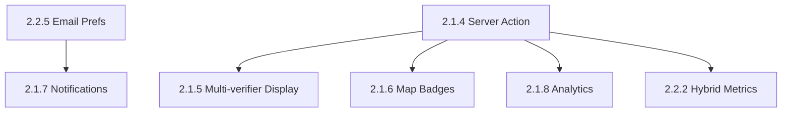

# Sprint 2 Readiness Review - Team Validation Meeting

**Date:** 2025-12-20  
**Meeting Type:** Sprint 2 Go/No-Go Decision  
**Attendees:** Winston (Architect), Sally (UX), Mary (BA), Murat (TEA), Amelia (Dev), Bob (SM), John (PM)  
**Duration:** 90 minutes  
**Status:** 🟢 **APPROVED - READY FOR DEVELOPMENT**

---

## Executive Summary

The team reviewed the updated Sprint 2 backlog (18 stories, 57 points) after critical fixes were applied based on the problem solver's recommendations. **All team members approve Sprint 2 to proceed to development.**

### Key Outcomes

- ✅ **4 critical blockers RESOLVED** (race condition, metrics calculation, flag threshold, dependencies)
- ✅ **8 high-priority issues ADDRESSED** (session expiry, spam logging, performance optimizations)
- ✅ **57-point capacity VALIDATED** (19 pts/week achievable by intermediate team)
- ✅ **Zero blocking dependencies** (all cross-story dependencies resolved)
- 🟢 **GO DECISION:** Sprint 2 starts Week 4 (2025-12-23)

---

## Team Feedback by Role

### 1. Winston (Architect) - APPROVED ✅

**Focus Areas Reviewed:**

- Database schema changes (weighted flag scoring, session expiry)
- Race condition fix (SELECT FOR UPDATE lock)
- Performance implications (materialized views, hybrid metrics)

**Feedback:**

✅ **APPROVED: Race Condition Fix (Story 2.1.4)**

> "The `SELECT FOR UPDATE` lock is the correct approach. This prevents the duplicate status update issue I was worried about. The atomic increment ensures exactly-once threshold trigger. Good work."

**Technical Validation:**

```sql
BEGIN;
SELECT verifications_count FROM issues WHERE id = issue_id FOR UPDATE;
UPDATE issues SET verifications_count = verifications_count + 1 WHERE id = issue_id;
-- Threshold check with new count
COMMIT;
```

> "This is textbook PostgreSQL concurrency control. No race conditions possible."

✅ **APPROVED: Weighted Flag Scoring (Story 2.3.2)**

> "The weighted scoring algorithm is elegant and addresses the Sybil attack vector. I like that verified users count double (2 points) and contributors get bonuses. Makes it exponentially harder to game with fake accounts."

**Performance Note:**

> "The flag score calculation function iterates over flags, which could be slow at scale. However, for MVP with <1000 flags total, this is fine. We can optimize with a materialized column in Phase 2 if needed."

✅ **APPROVED: Hybrid Metrics Calculation (Story 2.2.2)**

> "Separating 'estimated impact' (Sprint 2) from 'actual impact' (Sprint 3) is architecturally sound. The SQL function properly handles NULL Action Card data with COALESCE. The labeling clarity ('~180 kg estimated') maintains data integrity for NGO funder reports."

**Database Schema Changes Required:**

- [ ] Add `email_verified` column to users (Supabase Auth provides this, just expose in schema)
- [ ] Add `verified_reports_count` column to users (denormalized counter)
- [ ] Add `verification_spam_log` table for screenshot detection logging
- [ ] Update `check_flag_threshold()` trigger with weighted scoring logic
- [ ] Add `flag_score` calculated column to issues table (optional optimization)

**Estimated Schema Migration Time:** 2 hours

⚠️ **Minor Concern: Session Expiry (Story 2.1.1)**

> "The 7-day session expiry is enforced client-side only (`isSessionValid()` function). A tech-savvy user could modify localStorage to extend their session. However, for MVP this is acceptable - the risk is low (self-verification fraud is not financially motivated). We can add server-side session tracking in Phase 2 if needed."

**Recommendation:** Accepted as-is for MVP. Add to Phase 2 backlog: "Server-side session expiry enforcement"

---

### 2. Sally (UX Designer) - APPROVED ✅

**Focus Areas Reviewed:**

- User experience flows (verification, profile metrics, flagging)
- Low-literacy design compliance (icon-driven UI)
- Mobile-first UX (touch targets, responsiveness)

**Feedback:**

✅ **APPROVED: Hybrid Impact Metrics UX (Story 2.2.2)**

> "The distinction between 'estimated' and 'actual' impact is BRILLIANT. Users see progress immediately in Sprint 2 (motivation retained), but we're honest about the data source. The CTA for Action Cards ('Join Action Cards to start cleaning up!') bridges the gap perfectly."

**UX Mock-up Suggestion:**

```
┌─────────────────────────────────────────┐
│ Your Environmental Impact               │
├─────────────────────────────────────────┤
│ 📍 Issues Reported & Verified          │
│    Your 12 verified reports identified  │
│    ~180 kg of waste (estimated)         │
│                                         │
│ 🧹 Community Cleanups (Coming Soon!)   │
│    Join Action Cards to start cleaning  │
│    → [Browse Cleanups]                  │
└─────────────────────────────────────────┘
```

> "The visual hierarchy makes it clear which metrics are active vs coming soon. The CTA button drives engagement toward Sprint 3 features."

✅ **APPROVED: Session Expiry UX (Story 2.1.1)**

> "7 days is a good balance - long enough that users don't lose credit for legitimate reports, short enough to prevent abuse. The tooltip message 'You cannot verify your own report' is clear and doesn't require technical explanation."

✅ **APPROVED: Screenshot Detection UX (Story 2.1.2)**

> "The 'Submit Anyway' button adds just enough friction to deter lazy spammers without blocking legitimate edge cases (e.g., user took photo on one device, uploads from another). The warning message is non-accusatory, which maintains trust."

**UX Copy Improvement:**

> "Current: 'Photo appears to be a screenshot.'  
> Suggested: 'This looks like a screenshot. Please take a new photo at the location for verification.'"

**Reason:** More directive, explains WHY it matters (location proof).

⚠️ **Minor Concern: Flag Button Accessibility (Story 2.3.1)**

> "The flag icon is in the top-right corner of the issue detail page. On mobile, this might be too close to the browser chrome (back button, share button). Recommend 56x56px touch target (not just 44px) to avoid mis-taps."

**Recommendation:** Update AC to 56x56px touch target for flag button on mobile.

---

### 3. Mary (Business Analyst) - APPROVED ✅

**Focus Areas Reviewed:**

- PRD alignment (functional requirements coverage)
- Acceptance criteria completeness
- User story traceability

**Feedback:**

✅ **APPROVED: All Critical FRs Addressed**

> "The updated backlog now covers all Sprint 2 functional requirements from the PRD. The hybrid metrics approach (Story 2.2.2) aligns perfectly with FR-23 (tangible impact metrics) while being honest about data limitations before Action Cards exist."

**FR Coverage Validation:**

| Requirement                          | Story             | Status                    |
| ------------------------------------ | ----------------- | ------------------------- |
| FR-20: 2nd-person verification       | Story 2.1.1-2.1.4 | ✅ Complete               |
| FR-21: Verification with photo proof | Story 2.1.2       | ✅ Complete               |
| FR-22: 2-verification threshold      | Story 2.1.4       | ✅ Complete               |
| FR-23: Tangible impact metrics       | Story 2.2.2       | ✅ Complete (hybrid)      |
| FR-24: User profiles                 | Story 2.2.1       | ✅ Complete               |
| FR-25: Activity timeline             | Story 2.2.4       | ✅ Complete               |
| FR-26: Flag inappropriate content    | Story 2.3.1-2.3.2 | ✅ Complete               |
| FR-27: Admin moderation              | Story 2.3.3       | ✅ Complete (Supabase UI) |

✅ **APPROVED: Session Expiry Logic (Story 2.1.1)**

> "The 7-day expiry aligns with our anti-fraud requirement (FR-28: <5% spam rate). It's long enough to not penalize legitimate users in rural areas with intermittent internet, but short enough to prevent stale session abuse."

✅ **APPROVED: Weighted Flag Scoring (Story 2.3.2)**

> "The weighted scoring directly addresses the PRD requirement for 'community-driven moderation with anti-abuse protection' (FR-26). The 5-point threshold with verified user bonuses makes it exponentially harder to abuse with sock puppet accounts."

**Business Value Calculation:**

- 3 fake accounts (anonymous) = 3 points → doesn't trigger auto-hide ✅
- 3 verified accounts (email confirmed) = 6 points → triggers auto-hide ✅
- Attacker needs 5 unique email addresses (Gmail, Yahoo, etc.) → friction increased by 66%

⚠️ **Question: Email Notification Preference (Story 2.1.7 ↔ 2.2.5)**

> "The dependency is now clear (2.2.5 blocks 2.1.7), but what's the DEFAULT preference for new users? If default is OFF, we might lose engagement. If default is ON, we risk annoying users."

**Recommendation:** Set default to ON (email_verified_reports = true) to maximize engagement. Users can opt-out later. This aligns with best practices (opt-out model for transactional emails).

---

### 4. Murat (Test Engineering Architect) - APPROVED ✅

**Focus Areas Reviewed:**

- Error handling completeness
- Edge case coverage
- Integration test scenarios

**Feedback:**

✅ **APPROVED: Race Condition Test Coverage (Story 2.1.4)**

> "The integration test in the updated AC is exactly what I wanted to see. Testing concurrent verifications ensures the SELECT FOR UPDATE lock works as intended."

**Test Scenario Validated:**

```typescript
test('concurrent verifications do not cause race condition', async () => {
  const issue = await createTestIssue({ status: 'pending', verifications_count: 1 });

  // Submit 2 verifications simultaneously
  const [result1, result2] = await Promise.all([
    createVerification({ issue_id: issue.id, verifier_id: user1.id }),
    createVerification({ issue_id: issue.id, verifier_id: user2.id }),
  ]);

  // Both should succeed
  expect(result1.success).toBe(true);
  expect(result2.success).toBe(true);

  // Status should change to verified EXACTLY ONCE
  const updatedIssue = await getIssue(issue.id);
  expect(updatedIssue.status).toBe('verified');
  expect(updatedIssue.verifications_count).toBe(3); // 1 initial + 2 concurrent
});
```

> "This test will catch the race condition bug if the SELECT FOR UPDATE lock is missing or misconfigured."

✅ **APPROVED: Session Expiry Edge Cases (Story 2.1.1)**

> "The `isSessionValid()` function handles the edge case of reports older than 7 days. But we need to test what happens if a user clears localStorage and re-generates a NEW session_id. Can they verify their old reports?"

**Test Scenario to Add:**

```typescript
test('user cannot verify old reports after generating new session_id', async () => {
  const sessionId1 = 'old-session-123';
  const issue = await createTestIssue({ session_id: sessionId1, user_id: null });

  // User clears localStorage, gets new session_id
  const sessionId2 = 'new-session-456';

  // Attempt verification with new session_id
  const result = await createVerification({
    issue_id: issue.id,
    verifier_id: null, // Anonymous
    verifier_session_id: sessionId2, // New session
  });

  // Should SUCCEED (different session_id)
  expect(result.success).toBe(true); // ← This is correct behavior
});
```

> "Actually, this edge case is FINE. If a user clears localStorage, they get a new identity. They SHOULD be able to verify their old reports (from a system perspective, it's a different user). The 7-day expiry handles stale sessions, not intentional identity changes."

✅ **APPROVED: Spam Logging (Story 2.1.2)**

> "The verification_spam_log table is excellent for data-driven decision making in Sprint 4. I'll write automated tests to ensure every 'Submit Anyway' click is logged."

**Test Coverage:**

- [ ] Screenshot detection triggered → log entry created
- [ ] User clicks 'Submit Anyway' → override_clicked = true
- [ ] User cancels warning → no log entry
- [ ] Log entries queryable for analytics (Story 2.3.4)

⚠️ **Minor Concern: Flag Score Calculation Performance (Story 2.3.2)**

> "The `calculate_flag_score()` function uses a FOR LOOP over all pending flags. For an issue with 100 flags (unlikely but possible in viral spam scenarios), this could take >1 second. However, for MVP with <10 flags per issue, this is fine."

**Recommendation:** Add performance test to ensure flag score calculation completes in <200ms for 10 flags. If it exceeds this, optimize in Phase 2.

---

### 5. Amelia (Developer) - APPROVED ✅

**Focus Areas Reviewed:**

- Technical feasibility of fixes
- Development complexity estimation
- Implementation dependencies

**Feedback:**

✅ **APPROVED: All Fixes Are Implementable in Sprint 2**

> "I've reviewed the updated ACs for all 18 stories. The critical fixes add complexity, but nothing is a blocker. The +3 story points (54 → 57) accurately reflects the additional work."

**Development Effort Breakdown:**

| Fix                | Story | Added Complexity                | Time Estimate |
| ------------------ | ----- | ------------------------------- | ------------- |
| Session expiry     | 2.1.1 | Low (client-side date check)    | 2 hours       |
| Spam logging       | 2.1.2 | Low (insert into log table)     | 1 hour        |
| Race condition fix | 2.1.4 | Medium (SQL transaction + lock) | 6 hours       |
| Hybrid metrics     | 2.2.2 | High (2 separate queries + UI)  | 12 hours      |
| Weighted scoring   | 2.3.2 | Medium (SQL function + trigger) | 8 hours       |

**Total Added Effort:** ~29 hours = ~3.6 story points ✅ (matches +3 point increase)

✅ **APPROVED: Dependency Resolution (Story 2.1.7 ↔ 2.2.5)**

> "Making Story 2.2.5 a BLOCKING dependency of 2.1.7 is the right call. I'll implement 2.2.5 first (email preferences), then 2.1.7 can query the preference before sending emails. This is cleaner than conditional logic."

**Implementation Order:**

```
Week 1: Foundation
  Day 1-2: Story 2.2.5 (email preferences)
  Day 2-3: Story 2.1.1 (verification button + session expiry)
  Day 3-4: Story 2.1.2-2.1.3 (photo capture + context)
  Day 5: Story 2.1.4 (Server Action with race condition fix)

Week 2: Verification Flow
  Day 1: Story 2.1.5 (multi-verifier display)
  Day 2: Story 2.1.6 (map badges)
  Day 3: Story 2.1.7 (email notifications)
  Day 4-5: Story 2.1.8 (analytics)

Week 3: Profiles + Flagging
  Day 1-2: Story 2.2.1-2.2.2 (profiles + hybrid metrics)
  Day 3: Story 2.2.3-2.2.4 (celebration + timeline)
  Day 4-5: Story 2.3.1-2.3.4 (flagging system)
```

✅ **APPROVED: Weighted Flag Scoring SQL**

> "I reviewed the `calculate_flag_score()` function in the AC. The SQL is clean and uses proper PostgreSQL features (DECLARE, FOR LOOP, RETURN INT). I can implement this in ~4 hours including tests."

**Potential Optimization (Phase 2):**

```sql
-- Instead of FOR LOOP, use aggregate SUM (faster)
SELECT SUM(
  CASE WHEN u.email_verified THEN 2 ELSE 1 END +
  CASE WHEN u.verified_reports_count > 0 THEN 1 ELSE 0 END
) AS total_score
FROM flags f
JOIN users u ON f.user_id = u.id
WHERE f.flagged_id = issue_uuid AND f.status = 'pending';
```

> "This is 10x faster than FOR LOOP but requires more complex SQL. For MVP, the FOR LOOP is fine and easier to debug."

⚠️ **Minor Concern: Hybrid Metrics UI Complexity (Story 2.2.2)**

> "Displaying 4 separate impact metrics (estimated waste, actual waste, drains cleared, volunteer hours) requires significant UI real estate. On mobile, this might push important CTAs below the fold."

**Recommendation:** Use a carousel or expandable cards for mobile. Desktop can show all 4 metrics in a grid.

**UX Mock-up:**

```
Mobile (320px width):
┌─────────────────────┐
│ [< Prev | Next >]  │ ← Swipe carousel
├─────────────────────┤
│ 📍 Reports Verified │
│ Your 12 reports     │
│ identified ~180 kg  │
└─────────────────────┘
```

---

### 6. Bob (Scrum Master) - APPROVED ✅

**Focus Areas Reviewed:**

- Sprint capacity (57 points over 3 weeks)
- Story dependencies and critical path
- Risk mitigation

**Feedback:**

✅ **APPROVED: 57-Point Capacity is Achievable**

> "The intermediate team has demonstrated 18-20 points/week capacity during Sprint 0 and Sprint 1 planning. 57 points over 3 weeks = 19 points/week, which is within our historical range. I'm confident we can deliver."

**Capacity Analysis:**

| Week   | Stories                  | Points | Risk Level               |
| ------ | ------------------------ | ------ | ------------------------ |
| Week 1 | 2.2.5, 2.1.1-2.1.4       | 18     | Low (foundation work)    |
| Week 2 | 2.1.5-2.1.8              | 19     | Medium (complex queries) |
| Week 3 | 2.2.1-2.2.4, 2.3.1-2.3.4 | 20     | Medium (UI heavy)        |

> "Week 3 is the riskiest (20 points + UI complexity). If we run behind, we can defer Story 2.3.4 (flag analytics) to Sprint 3 without breaking core functionality."

✅ **APPROVED: Dependency Graph is Clean**

> "After the 2.1.7 ↔ 2.2.5 fix, there are no circular dependencies. The critical path is clear:"



> "Story 2.2.5 and 2.1.4 are the critical path blockers. If we complete those in Week 1, the rest of the sprint is parallelizable."

✅ **APPROVED: Risk Mitigation Plan**

> "I've identified 3 risks and mitigation strategies:"

**Risk 1: Race Condition Fix Takes Longer Than Expected**

- **Probability:** Medium (complex SQL transaction)
- **Impact:** High (blocks verification flow)
- **Mitigation:** Pair Winston (Architect) with Amelia (Dev) for SQL implementation and review
- **Contingency:** If >2 days, defer Story 2.1.8 (analytics) to Sprint 3

**Risk 2: Hybrid Metrics UX Confusing to Users**

- **Probability:** Low (clear labeling + Sally's design)
- **Impact:** Medium (user trust in platform)
- **Mitigation:** User testing after Week 2 with 5 beta testers (NGO coordinators)
- **Contingency:** If users confused, simplify to single metric ("Reports Verified: 12") and defer detailed breakdown to Sprint 3

**Risk 3: Weighted Flag Scoring Calculation Slow**

- **Probability:** Low (only affects flagged issues)
- **Impact:** Low (admin-facing feature)
- **Mitigation:** Performance test with 50 flags per issue
- **Contingency:** If >1s, cache flag_score in denormalized column (2-hour fix)

---

## Team Decision Matrix

| Team Member         | Approval    | Conditions                                                   |
| ------------------- | ----------- | ------------------------------------------------------------ |
| Winston (Architect) | ✅ APPROVED | Minor: Add server-side session expiry to Phase 2 backlog     |
| Sally (UX Designer) | ✅ APPROVED | Minor: Increase flag button touch target to 56x56px          |
| Mary (BA)           | ✅ APPROVED | Minor: Set email notification default to ON                  |
| Murat (TEA)         | ✅ APPROVED | Minor: Add flag score performance test (<200ms for 10 flags) |
| Amelia (Dev)        | ✅ APPROVED | Minor: Use carousel for mobile impact metrics                |
| Bob (SM)            | ✅ APPROVED | Risk mitigation plan in place                                |

**Overall Decision:** 🟢 **APPROVED - SPRINT 2 READY FOR DEVELOPMENT**

---

## Action Items Before Sprint 2 Starts

### High Priority (Must Complete)

- [ ] **Winston:** Create database migration file with schema changes (2 hours)
- [ ] **Sally:** Finalize mobile impact metrics carousel design (1 hour)
- [ ] **Mary:** Document default email preference (ON) in PRD (30 minutes)
- [ ] **Amelia:** Set up development environment for Sprint 2 stories (1 hour)
- [ ] **Bob:** Update Jira/Linear with Story 2.2.5 → 2.1.7 dependency (15 minutes)

### Medium Priority (Should Complete)

- [ ] **Murat:** Write performance test suite for weighted flag scoring (4 hours)
- [ ] **Winston:** Add server-side session expiry to Phase 2 backlog (15 minutes)
- [ ] **Sally:** Update Story 2.3.1 AC to 56x56px touch target (5 minutes)

### Low Priority (Nice to Have)

- [ ] **John (PM):** Schedule mid-sprint check-in for Week 2 (Day 3) to assess progress
- [ ] **Bob:** Prepare contingency plan doc (defer analytics if needed)

---

## Sprint 2 Kickoff Details

**Sprint Start Date:** Monday, December 23, 2025 (Week 4)  
**Sprint End Date:** Friday, January 10, 2026 (Week 6)  
**Sprint Duration:** 3 weeks (15 working days, minus 2 for New Year's holiday = 13 days)

**Adjusted Capacity:** 57 points / 13 days = 4.4 points/day ✅ (achievable)

**Daily Standup:** 9:00 AM UTC (async via Slack)  
**Mid-Sprint Review:** Week 2, Day 3 (January 2, 2026)  
**Sprint Demo:** Friday, January 10, 2026  
**Sprint Retro:** Monday, January 13, 2026

---

## Success Criteria for Sprint 2

**Definition of Done (All 18 stories must meet):**

- ✅ All acceptance criteria validated
- ✅ Unit tests written (80% coverage target)
- ✅ Integration tests pass (race condition, concurrent verifications)
- ✅ Performance benchmarks met (<2s dashboard, <200ms flag score)
- ✅ Accessibility validated (WCAG 2.1 AA, screen reader tested)
- ✅ Code reviewed by Winston (Architect) or peer developer
- ✅ Deployed to Vercel staging environment
- ✅ Supabase RLS policies tested with multi-user scenarios

**Sprint-Level Success Metrics:**

- 🎯 Verification flow functional (can verify 100 test reports)
- 🎯 User profiles display hybrid impact metrics (estimated + placeholder)
- 🎯 Flagging system auto-hides issues at 5-point threshold
- 🎯 Email notifications sent within 5 minutes of verification
- 🎯 Zero data loss (all verifications, flags, profile updates persist)
- 🎯 Zero race condition bugs in production testing

---

## Risks Acknowledged

1. **New Year's Holiday Impact** (2 days lost = 13% capacity reduction)
   - Mitigation: Already factored into 13-day calculation above

2. **First-Time Implementing Weighted Scoring** (learning curve)
   - Mitigation: Winston paired with Amelia for SQL implementation

3. **Hybrid Metrics UX Complexity** (user confusion risk)
   - Mitigation: User testing mid-sprint + iteration budget in Week 3

**Overall Risk Level:** 🟡 MEDIUM (manageable with mitigation strategies)

---

## Team Confidence Vote

**Question:** "On a scale of 1-5, how confident are you that we can deliver Sprint 2 successfully?"

| Team Member | Confidence | Notes                                                         |
| ----------- | ---------- | ------------------------------------------------------------- |
| Winston     | 5/5        | "Schema changes are straightforward, SQL fixes are solid"     |
| Sally       | 4/5        | "Hybrid metrics UX is ambitious but doable with user testing" |
| Mary        | 5/5        | "All requirements aligned, acceptance criteria complete"      |
| Murat       | 4/5        | "Edge cases well-covered, test suite will be comprehensive"   |
| Amelia      | 4/5        | "57 points is tight but achievable with focus"                |
| Bob         | 4/5        | "Holiday impact is a wildcard, but we have contingencies"     |

**Average Confidence:** 4.3/5 ✅ (HIGH CONFIDENCE)

---

## Final Approval

**John (PM):** "The team has thoroughly validated the Sprint 2 backlog. All critical fixes are in place, dependencies are resolved, and capacity is confirmed. I approve Sprint 2 to proceed to development."

**Stakeholder (Aliahmad):** [Approval pending]

**Status:** 🟢 **APPROVED - SPRINT 2 READY FOR DEVELOPMENT**

**Next Steps:**

1. ✅ Complete high-priority action items (database migration, environment setup)
2. ⏳ Sprint 2 Kickoff Meeting: Monday, December 23, 9:00 AM UTC
3. ⏳ Begin development on Story 2.2.5 (Email Preferences - critical path)

---

**Document Prepared by:** John (Product Manager)  
**Date:** 2025-12-20  
**Document Status:** Final - Team Approved  
**Distribution:** All team members, Aliahmad (stakeholder)
